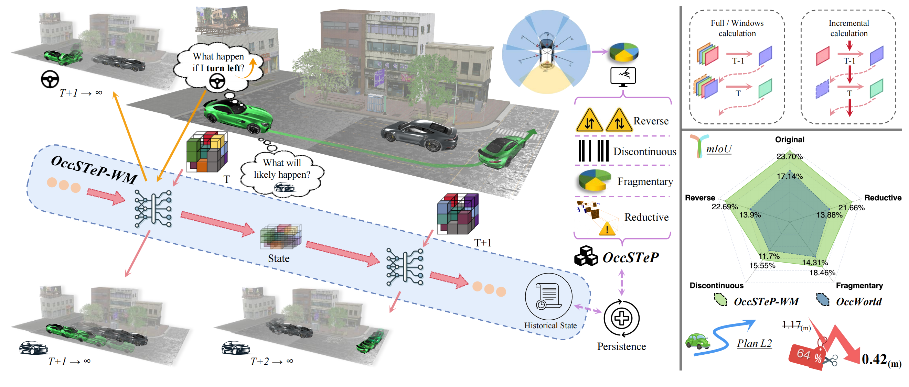
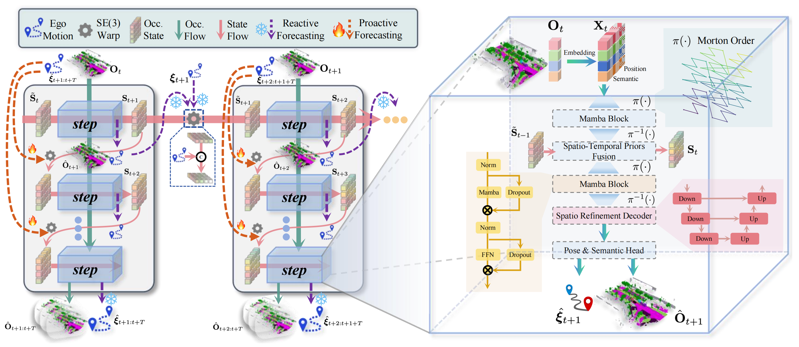

<div align="center">
<h1> OccSTeP: Benchmarking 4D Occupancy Spatio-Temporal Persistence</h1>

<!-- <a href="https://arxiv.org/abs/2512.15621"></a> -->
</div>

<!-- 
[](https://arxiv.org/abs/2512.15621) [](LICENSE) -->

<div align="center">
    <a href="https://arxiv.org/abs/2512.15621">
        Paper
    </a>
    &nbsp; | &nbsp;
    <a href="https://insai-lab.github.io/OccSTeP.github.io/">
        Website
    </a>
    &nbsp; | &nbsp;
    <a href="https://github.com/FaterYU/OccSTeP">
        Code
    </a>
</div>


> 🔗 This work is already transfer to [InSAI Lab@HNU](https://github.com/InSAI-Lab).

## Overview



## News

- **2025.12.17**: The paper is released on [arXiv](https://arxiv.org/abs/2512.15621)!

## Abstract

Autonomous driving requires a persistent understanding of 3D scenes that is robust to temporal disturbances and accounts for potential future actions. We introduce a new concept of 4D Occupancy Spatio-Temporal Persistence (**OccSTeP**), which aims to address two tasks: (1) reactive forecasting: "_what will happen next_" and (2) proactive forecasting: "_what would happen given a specific future action_". For the first time, we create a new OccSTeP benchmark with challenging scenarios (e.g., erroneous semantic labels and dropped frames). To address this task, we propose **OccSTeP-WM**, a tokenizer-free world model that maintains a dense voxel-based scene state and incrementally fuses spatio-temporal context over time. OccSTeP-WM leverages a linear-complexity attention backbone and a recurrent state-space module to capture long-range spatial dependencies while continually updating the scene memory with ego-motion compensation. This design enables online inference and robust performance even when historical sensor input is missing or noisy. Extensive experiments prove the effectiveness of the OccSTeP concept and our OccSTeP-WM, yielding an average semantic mIoU of $23.70$ ( $+6.56$ gain) and occupancy IoU of $35.89$ ( $+9.26$ gain). The data and code will be open source.

## Framework



## Citation

If you find this work useful in your research, please consider citing:

```
@article{zheng2025occstep,
  title={OccSTeP: Benchmarking 4D Occupancy Spatio-Temporal Persistence},
  author={Zheng, Yu and Hu, Jie and Yang, Kailun and Zhang, Jiaming},
  journal={arXiv preprint arXiv:2512.15621},
  year={2025}
}
```

## Acknowledgements

- [OccWorld](https://github.com/wzzheng/OccWorld)
- [mamba](https://github.com/state-spaces/mamba)
